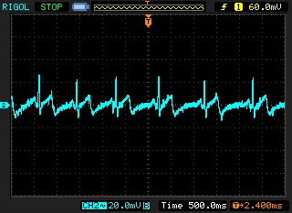

EKG Sensor.
========
The mobile phone as a medical instrument.
--------------------------------

We believe that any hospital,
village clinic, or doctor can have access to advanced health care instruments
like an EKG monitor for little more than the cost of a mobile phone.

Health care facilities in developed countries have access to a large number of
medical instruments unavailable to health care professionals in the developing
world. One example of such an instrument is the EKG monitor. EKG signals are
used to diagnose a wide range of medical conditions but they are often
unavailable in all but the most advanced hospitals in developing countries like
India, Ghana etc.  We aim to
design a low-power, low-cost EKG monitor that uses the "HiJack" platform for
interfacing between the EKG sensor peripheral and the mobile phone, and the
mobile phone for visualizing the ECG waveform.

[HOMEPAGE_BREAK]

### POTENTIAL IMPACT ###

This simple, plug-and-play, power+data over the audio interface of the mobile
phone to monitor the EKG is just the first step towards a broader personal and
participatory sensing applications like blood glucose monitor, blood pressure
monitor and body temperature monitor. Such a monitoring device, costing just a
few dollars, can enable village clinics throughout the developing world to gain
access to modern medical equipment at a fraction of the cost. Mobile devices
have the potential to seamlessly blend health care into our daily lives.
Evolving mobile health technology will empower individuals to better monitor
and manage their own health, encouraging them to live healthier lifestyles and
prevent many health problems before they begin. In addition, mobile health can
help professional care-givers to better monitor their patients, detect problems
earlier, and reduce the need for hospital visits that are expensive and
inconvenient to patients.

### DESCRIPTION ###

At the heart of the EKG sensor is a low power CMOS instrumentation amplifier
and filtering circuitry to minimize the drawn current and noise effect on the
EKG signal. It is a 3 lead monitoring system, where the red and white leads
receive signals from patient's wrists, and the black lead is connected to the
right leg to reduce the baseline drift. The sensor module is interfaced with
the HiJack platform to deliver the resulting EKG trace on the smartphone
screen. The entire module is implemented in a square-inch area footprint and
consumes only 130 µA (0.35 mW). The following figure shows the EKG signal of an
individual on the oscilloscope.

### FUTURE DIRECTIONS ###

Implement a few algorithms on the EKG data collected to predict any heart
abnormality like arrhythmia.  Integrating the EKG data from the smartphone with
a social networking website like Facebook where a person's EKG will complement
his virtual persona online. The doctor would just have to log into Facebook and
have access to his patient's medical information. He can notice any abnormal
activity in real-time and take fast preventive action.  Design a dedicated
ultra-low power (< 1 µW) EKG sensing chip to perform continuous heart
monitoring for enabling battery free EKG measurements powered by energy
harvesting.

### RELEVANT READINGS ###

"Micropower Electrocardiogram Amplifier" L. Fay, V. Misra, R. Sarpeshkar, IEEE Transactions on Biomedical Circuits and Systems, Vol. 3, No. 5, pp. 312-320, October, 2009.

"A Portable, Low-Power, Wireless Two-Lead EKG System" Thaddeus Fulford-Jones, Gu-Yeon Wei, Matt Welsh, 26th IEEE EMBS Annual International Conference, September, 2004.
